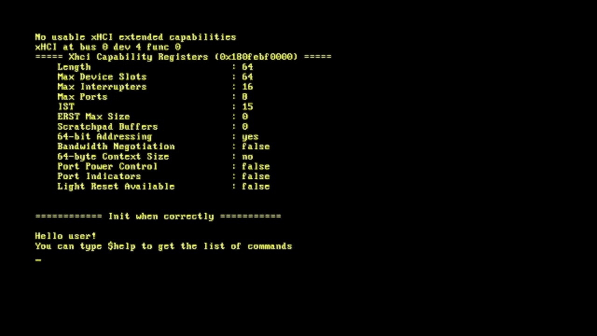

# GlowOS

---

## Index

1. [How to Install and Run](#how-to-install-and-run)
2. [Terminal Commands](#terminal-commands)
3. [Technical Details](#technical-details)
4. [Todo](#todo)
5. [Long term goals](#long-term-goals)
6. [License](#license)
7. [Contributing](#contributing)
8. [Current State](#current-state)

---

## How to Install and Run

### Prerequisites

Before running GlowOS, ensure you have the following installed on your system:

- **Rust**: You will need the Nightly toolchain and the `llvm-tools-preview` component for kernel development.
- **QEMU**: The emulator used to run the OS.
-**Open Virtual Machine Firmware**: An extra program for QEMU to run properly the kernel.
- **Bash**: A Unix-like shell to execute the startup script.

### Setup Instructions

1. **Clone the repository:**
   ```bash
   git clone https://github.com/Magicchess1244/GlowOS.git
   cd GlowOS
   ```

2. **Configure the Rust toolchain:**
   Make sure you are using the nightly channel and have the required components installed:
   ```bash
   rustup override set nightly
   rustup component add llvm-tools-preview
   ```

3. **Run the OS in QEMU:**
   Cargo run will automaticly execute the provided bash script to compile the kernel and launch it inside a QEMU virtual machine:
   ```bash
   Cargo run
   ```

4. **Test the OS:**
   Cargo test will automaticly execute the test that are provided:
   ```bash
   Cargo test
   ```

5. **Run the OS in a USB:**
   Cargo run will automaticly execute the provided bash script to compile the kernel and deploy it to the USB:
   ```bash
   chmod +x deploy_usb.sh
   sudo ./deploy_usb.sh
   ```


---

## Terminal Commands

> Every command must be prefixed with `$`. The space between `$` and the command is optional — both `$help` and `$ help` are valid. And the commands are not case sensetive

| Command | Description |
|---|---|
| `$help` | Displays the name of all commands and a short description of each. |
| `$echo` | Prints anything you pass in. Arguments are separated by a space when displayed. |
| `$clear` | Clears the screen. |
| `$set_color` | Changes the color of the text and/or background. |
| `$update_color` | Updates all text on screen to use the currently set color. |
| `$xhci_log` | Shows xHCI's logs. |
| `$xhci_log_cap_register` | Shows xHCI's log capability registers. |
| `$xhci_log_op_register` | Shows xHCI's log operational registers. |

---

## Technical Details

- **Booting**: The boot proces is done via UEFI.
- **Display**: Output is rendered via the **frame buffer**, which is currently in progress.
- **Memory Management**: The kernel implements **paging** for virtual memory and **dynamic memory allocation** for heap usage at runtime.
- **Interrupts**: Interrupt handling is set up to manage hardware and software events.
- **USB**: USB support via **xHCI** is currently in progress.
- **Testing**: The kernel includes **cargo tests** for verifying core functionality.

---

## Todo

- [x] Improve and make a somewhat finished README
- [x] Scroll up and down → No clear line when chars reach it
- [x] Add queue to the vga to stop dead locks -> I just don't print
- [x] Add a history of commands and access it with arrow keys
- [ ] Add a font renderer
- [ ] Reset xHCI controler
- [ ] Add multithreading
- [ ] Add a way to insert letters in the middle of words without erasing them
- [ ] File system
- [ ] Read and write to USB
- [ ] Add a config file for visuals


---

## Long term goals

- [ ] Add multithreading
- [ ] Merge linked list
- [ ] File system
- [ ] Add userspace
- [ ] Add a scheduler
- [ ] Delete all dependecies

---

## License

This project is licensed under the **MIT License**.
See the `LICENSE` file for more details.

---

## Contributing

Contributions, ideas, and optimizations are welcome!
Feel free to open issues or submit pull requests.

---

## Current State

